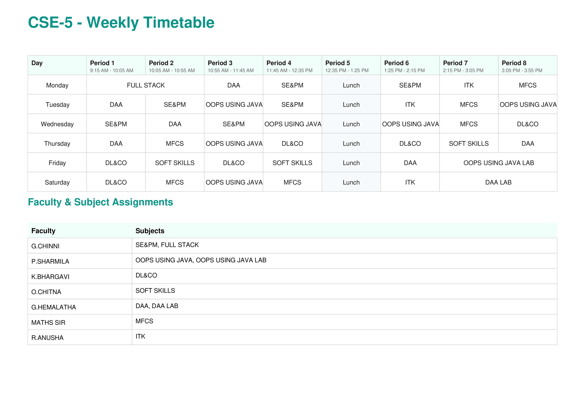

# Timely — Intelligent Timetable Generator

<p align="center">
  
</p>

[](License.txt)

**Timely** is a high-performance, constraint-based scheduling engine designed to automate the complex logistics of academic timetable generation. Developed by **Gowtham Kondapalli**, it leverages client-side background processing to deliver optimized schedules for multiple sections without the need for backend infrastructure.

---

## 🚀 Strategic Overview

Educational scheduling is a multi-dimensional puzzle involving conflicting constraints: faculty availability, student workload, and pedagogical limits. **Timely** solves this by utilizing a sophisticated assignment algorithm that respects both hard and soft constraints, ensuring a balanced workload for staff and students.

### Technical Pillars:
* **Constraint-Based Logic:** Automatically resolves scheduling conflicts based on weighted rules, such as maximum subjects per day and consecutive period limits.
* **Web Worker Implementation:** The generation engine is offloaded to a background thread (`worker.js`), ensuring the UI remains 100% responsive even during heavy computation.
* **Privacy-First Architecture:** Operates entirely within the browser's sandbox. Data is persisted via `localStorage`, ensuring zero data leakage to external servers.
* **Professional Output:** Integrated with `pdf-lib` to generate print-ready PDF exports including comprehensive faculty-subject mappings.

---

## ✨ Key Features

### 🛠️ Configuration & Customization
* **Dynamic Timeframes:** Set custom periods per day, start times, and durations (30–90 mins).
* **Smart Breaks:** Configurable lunch break placements that the algorithm automatically respects.
* **Workload Balancing:** Define global limits for Labs, Activities, and individual Subjects to prevent student burnout.

### 👨‍🏫 Faculty & Subject Management
* **Granular Availability:** A dedicated availability matrix for every faculty member, allowing for period-by-period exclusions.
* **Categorized Learning:** Support for instruction types: **Subject** (standard), **Lab** (multi-period blocks), and **Activity**.
* **Assignment Preferences:** Priority scheduling for specific sessions based on user-defined day/period preferences.

---

### Automated Schedule Output


---

## 🏗️ Technical Stack

* **Logic:** Vanilla JavaScript (ES6+).
* **Concurrency:** Web Workers API.
* **Styling:** CSS3 with variable-based theming (Light/Dark mode).
* **Document Generation:** PDF-Lib.js.
* **Persistence:** Web Storage API (Local Storage).

---

## 🏁 Getting Started

### Prerequisites
To ensure the Web Worker functions correctly due to browser security policies (CORS), the project must be served via a local server. Opening the `index.html` file directly from your file system will result in a security error.

### Installation
1.  **Clone the repository:**
    ```bash
    git clone [https://github.com/gowtham2thrive/Timely.git](https://github.com/gowtham2thrive/Timely.git)
    ```
2.  **Navigate to the directory:**
    ```bash
    cd Timely
    ```
3.  **Launch via a local server:** Use the **Live Server** extension in VS Code or run `python -m http.server`.

---
